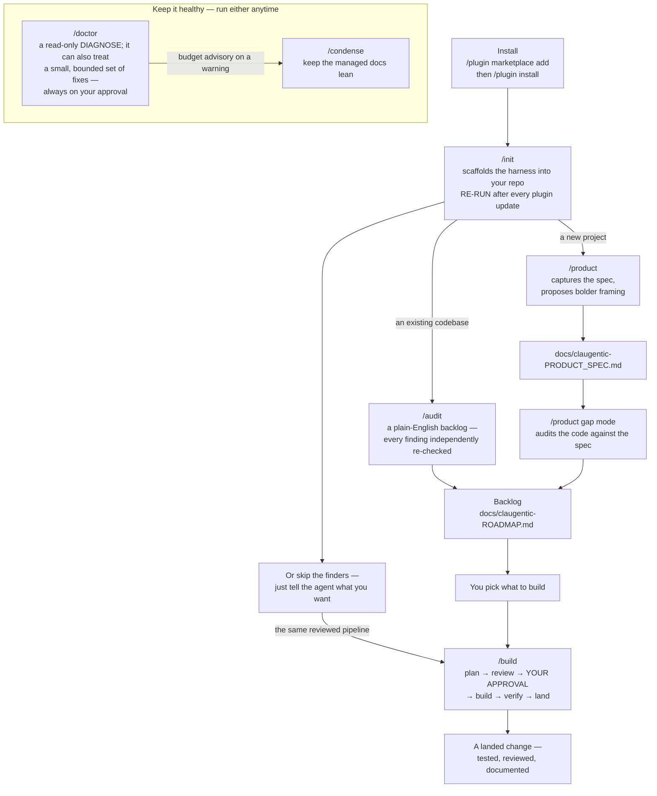
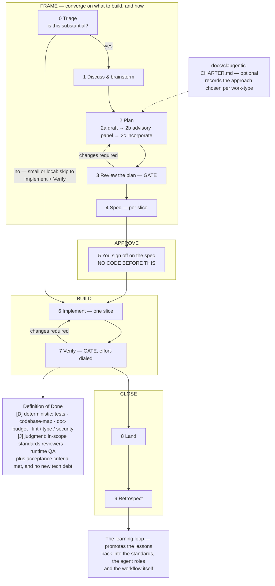

# claugentic-dev-harness

A Claude Code plugin that turns AI coding into a disciplined, reviewable process — it plans, reviews its own work, and **puts your sign-off before the build on every substantial change** (small, local fixes take a lightweight path: still reviewed, not sign-off-gated).

## Install

Type these in the Claude Code chat (the same place you talk to Claude — not a separate terminal):

```
/plugin marketplace add sh4npeiris/claugentic-dev-harness
/plugin install claugentic-dev-harness@sh4npeiris
/claugentic-dev-harness:init
```

## Commands

The skills, in the order you use them. Type the **full** name (`/claugentic-dev-harness:…`) so they're never confused with Claude Code's built-ins like `/init`:

- **init** · `/claugentic-dev-harness:init` — scaffold the harness into your repo (codebase map + standards + workflow docs; never overwrites your content unasked).
- **product** · `/claugentic-dev-harness:product` — *(optional)* define what you're building; it proposes ways to make the spec more ambitious.
- **audit** · `/claugentic-dev-harness:audit` — get a prioritized, plain-English backlog of what's worth doing, each item independently double-checked.
- **build** · `/claugentic-dev-harness:build` — work that backlog through the reviewed pipeline (plan → review → your approval → build → verify), one slice at a time.
- **doctor** · `/claugentic-dev-harness:doctor` — check the harness's own health in your repo (read-only snapshot; acts only on your approval).
- **condense** · `/claugentic-dev-harness:condense` — condense an over-budget managed doc (DECISIONS / ROADMAP / etc.): it classifies entries, then proposes a diff you approve.

**Then what?** New / empty project → just tell the agent what to build (run `/claugentic-dev-harness:product` first for the vision). Existing codebase → `/claugentic-dev-harness:audit`, then `/claugentic-dev-harness:build`.

Here's how those commands fit together — install once, discover work, build it through a reviewed pipeline, and keep it healthy:



Everything those commands produce — the backlog, the spec, the plans, the docs — is written into **your own repo**, as plain files you can read, edit and commit.

---

The mission is **addractive** software — *attractive + addictive by merit*: earned pull through craft and delight, the honest opposite of dark-pattern "addiction" (no traps, no manipulation). The harness doesn't promise beautiful software — it **forces the craft question**, **checks the safety and accessibility floor** (mechanically where your tooling is wired, by reviewer judgment otherwise), and **routes the taste verdict to you.** It never certifies "beautiful"; it raises the bar and hands you the call.

You steer with plain-English decisions; it does the engineering one reviewed slice at a time.

New to this? Start with **[`docs/claugentic-PLAYBOOK.md`](docs/claugentic-PLAYBOOK.md)** — a plain-English guide for non-engineers. *(Tip: a quick `/clear` gives the cleanest slate — worth it before a big `:audit` run.)*

## Updating

The plugin installs once (globally); each repo gets the docs via `init`. To move to a newer release:

```
/plugin marketplace update sh4npeiris
/plugin update claugentic-dev-harness@sh4npeiris
```

Then re-run **`/claugentic-dev-harness:init`** in each repo — it's version-aware: it refreshes the managed docs to the new version and **never touches your own content unasked** (your spec, roadmap, and edits are left alone; the one path that would overwrite a file of yours stops and confirms first).

> **Commands not showing up** after install or update? Quit Claude Code fully, delete `plugin-catalog-cache.json` from your config folder (`~/.claude/` — `%USERPROFILE%\.claude\` on Windows; it's just a cache, safe to delete), reopen, and re-run the two install commands.

## Honest about what's real

The harness's whole pitch is honesty, so here's the straight version:

- **Mechanical (two real gates):** the two checks `init` chains into your pre-commit hook — deterministic, no-LLM, at commit time, on ordinary commits **and on a conflict-free `git merge`** — where a failure in one never hides the other's message. The **codebase-map check** blocks the commit when a file in the map's scope (the globs `init` picks for your languages — not literally every file on disk) is missing from the map, or the map still lists one that's gone. The **doc-budget check** blocks it when a managed doc outgrows its byte cap in your repo's own `.claude/claugentic-doc-budgets.json` — `init` seeds that file with recommended caps, tuning or deleting them is yours, and with no file at all it measures nothing and exits quietly, so it gates only where a repo opted in. Both are gates **only wherever `init` wired that hook**: a repo that keeps its own tooling with the gate off has neither, git never activates hooks on clone (each teammate runs the one-line bootstrap `init` leaves in your CLAUDE.md), and a machine with no working Python still commits, with one loud skip notice. They check that files are *documented* and docs stay *bounded*, **not** that the code is *good*, and they compose with your own linters and tests rather than replacing them.
- **Model-upheld (judgment, not a guarantee):** the approval gate itself, every review, and the audit's double-checks — sign-off-before-code is a rule the workflow and the `build` skill instruct, not a hook that can block a commit. A skeptical reviewer is a **separate specialist agent with a clean context** — it never sees the builder's reasoning, so it can't rubber-stamp it. A reduction of rubber-stamping risk, **not** independence (it runs the same capable model, so model blind spots aren't independent). The audit *tries to refute* each finding and tags what came back; it never presents judgment as proof.
- **Not built yet:** the mechanical trust-gates that would make a fully-unwatched run safe (a land-gate that blocks a bad commit, a secret-scan). So an unwatched "build-to-green" run is offered only where a repo has earned it (CI, a test baseline, an approved spec) — and otherwise declines honestly, naming what's missing.

## Under the hood *(optional)*

- A **staged workflow** (`docs/claugentic-WORKFLOW.md`): Triage → Discuss → Plan → Review → Spec → **Approve** → Implement → Verify → Land → Retrospect. Small changes skip straight to Implement.
- **9 specialist sub-agents** (bundled in the plugin — not a directory your repo provides) — a plan critic, a builder, a **product designer** that also pushes your spec to be more ambitious, per-standard reviewers, an anti-over-engineering skeptic, a finding double-checker, a runtime QA agent, an honesty reviewer, and a retrospective harvester — so the main agent stays focused on your decisions.
- A relevance-loaded **standards catalog** (`docs/claugentic-standards/`, ISO/IEC 25010-anchored), with each finding labeled by how confidently it was checked.

Here's the full lifecycle of a substantial change — what `:build` runs each item through, and how every landed change feeds back to improve the harness itself:



**Requires** `git` and **Python 3** (for the two commit-time checks; without them the agent maintains the map by hand and the caps go unchecked). Public + **Apache-2.0** — install at **user scope** to use it across all your repos. `init` generates a file-by-file map of your repo at `docs/claugentic-ARCHITECTURE_TREE.md` — unless you tell it to keep a map you already have, which leaves the codebase-map check off too.
